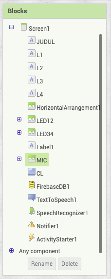
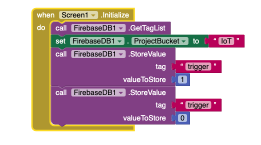
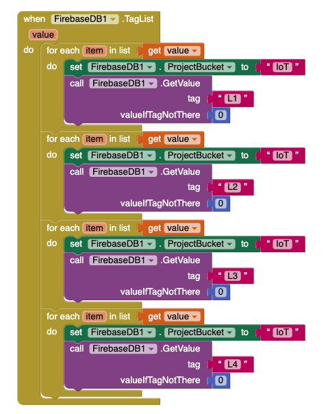
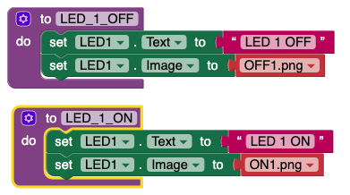
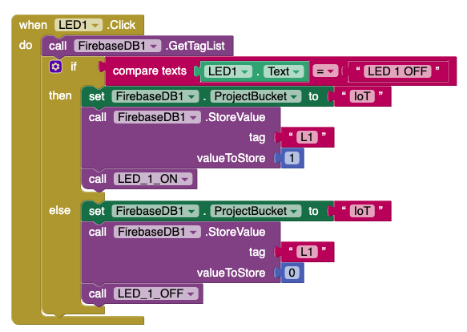
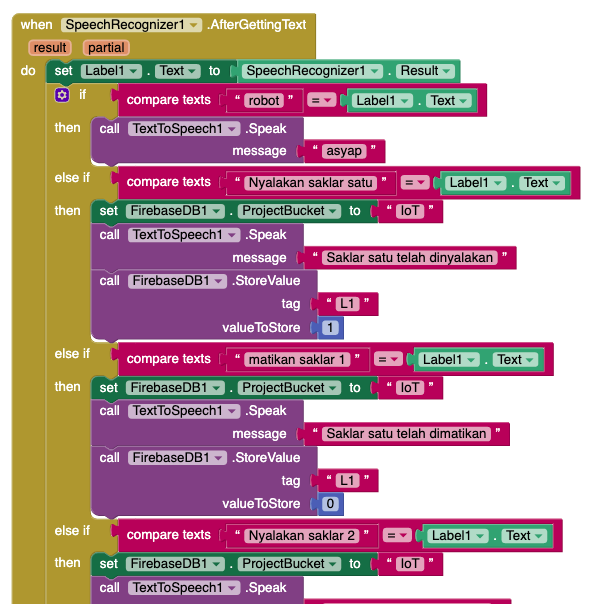

# Saklarku

Project Saklar berbasis IoT menggunakan Esp8266 (NodeMCU) dan ESP32

## Dokumentasi

Dokumentasi untuk memudahkan menggunaan Project

1. [Sketch Untuk Hardware](#sketch-untuk-hardware)
2. [Wiring Diagram pada Hardware](#wiring-diagram-pada-hardware)
3. [Block Diagram Untuk Aplikasi Android](#block-diagram-untuk-aplikasi-android)

### Sketch Untuk Hardware

Sketch file untuk mikrokontroler terletak pada [code.ino](project/code/code.ino)

Project ini menggunakan beberapa library tambahan untuk koneksi ke database dan pharsing json

Library Firebase Untuk [ESP8266](https://github.com/mobizt/firebase-esp8266) dan untuk [ESP32](https://github.com/mobizt/Firebase-ESP32)
Menentukan library berdasarkan Board yang akan digunakan, hal ini dikarenakan kopatibelitas antar ESP32 dan ESP8266:

```cpp
#if defined(ESP32)
  #include <WiFi.h>
  #include <FirebaseESP32.h>
#elif defined(ESP8266)
  #include <ESP8266WiFi.h>
  #include <FirebaseESP8266.h>
#endif
```

Library [ArduinoJson](https://github.com/bblanchon/ArduinoJson) untuk pharsing json dari database, Dokumentsi dapat dilihat pada [ArduinoJson.org](https://arduinojson.org/v6/doc):

```cpp
#include <ArduinoJson.h>
```

Deklarasi Objek & variabel yang dibutuhkan

```cpp
/* 1. Define the WiFi credentials */
#define WIFI_SSID "KAnggara75v6"
#define WIFI_PASSWORD "kukukakiku"

/* 2. If work with RTDB, define the RTDB URL and database secret */
#define DATABASE_URL "thesis1121-default-rtdb.firebaseio.com"
#define DATABASE_SECRET "xvXuh62QtDsNbOpPFCNSui8Lp4gmFCWmBq7aTo9v"

/* 3. Define the Firebase Data object */
FirebaseData fbdo;

/* 4, Define the FirebaseAuth data for authentication data */
FirebaseAuth auth;

/* Define the FirebaseConfig data for config data */
FirebaseConfig config;

#define Relay1 D0 //Pin 16 NodeMcu sebagai D0 PinOut
#define Relay2 D1 //Pin 16 NodeMcu sebagai D1 PinOut
#define Relay3 D2 //Pin 16 NodeMcu sebagai D2 PinOut
#define Relay4 D3 //Pin 16 NodeMcu sebagai D3 PinOut

// Variabel untuk menampung data
int val1, val2, val3, val4;
```

Inisialisasi I/O dan melakukan persiapan koneksi WiFi

```cpp
void setup()
{
  Serial.begin(115200); //Baud Rate untuk Serial Monitor
  pinMode(Relay1, OUTPUT);
  pinMode(Relay2, OUTPUT);
  pinMode(Relay3, OUTPUT);
  pinMode(Relay4, OUTPUT);
  pinMode(LED_BUILTIN, OUTPUT);

  WiFi.begin(WIFI_SSID, WIFI_PASSWORD);
  Serial.print("connecting");
  while (WiFi.status() != WL_CONNECTED)
  {
    Serial.print("=");
    delay(500);
  }
  Serial.println();
  Serial.print("Connected with IP: ");
  Serial.println(WiFi.localIP());
  Serial.println();
```

Melakukan koneksi ulang ketika sambungan WiFi terputus

```cpp
  WiFi.setAutoReconnect(true);
  WiFi.persistent(true);
```

Menampilkan versi client, dan melakukan koneksi ke Firebase

```cpp
  Serial.printf("Firebase Client v%s\n\n", FIREBASE_CLIENT_VERSION);

  /* Assign the certificate file (optional) */
  //config.cert.file = "/cert.cer";
  //config.cert.file_storage = StorageType::FLASH;

  /* Assign the database URL and database secret(required) */
  config.database_url = DATABASE_URL;
  config.signer.tokens.legacy_token = DATABASE_SECRET;

  Firebase.reconnectWiFi(true);

  /* Initialize the library with the Firebase authen and config */
  Firebase.begin(&config, &auth);

  // Or use legacy authenticate method
  // Firebase.begin(DATABASE_URL, DATABASE_SECRET);
}
```

```cpp
void loop()
{
  // Mengambil data dan menampilkanya termasuk jika terdapat error dan penyebabnya
  Serial.printf("Get json... %s\n", Firebase.getJSON(fbdo, "IoT") ? fbdo.to<FirebaseJson>().raw() : fbdo.errorReason().c_str());

  // Patch data from DB
  String data = fbdo.to<FirebaseJson>().raw();
```

```cpp
  // Pharsing data
  StaticJsonDocument<128> doc;
  DeserializationError error = deserializeJson(doc, data);

  if (error) {
    Serial.print(F("deserializeJson() failed: "));
    Serial.println(error.f_str());
    return;
  }

  val1 = doc["L1"];
  val2 = doc["L2"];
  val3 = doc["L3"];
  val4 = doc["L4"];
```

```cpp
  // Cek data lalu jalankan perintah ON ataupun OFF
  if (val1 == 0)
  {
    digitalWrite(Relay1, LOW);
    digitalWrite(LED_BUILTIN, LOW);
    Serial.println("light 1 ON");
  }
  else if (val1 == 1)
  {
    digitalWrite(Relay1, HIGH);
    digitalWrite(LED_BUILTIN, HIGH);
    Serial.println("light 1 OFF");
  }

  if (val2 == 0)
  {
    digitalWrite(Relay2, LOW);
    Serial.println("light 2 ON");
  }
  else if (val2 == 1)
  {
    digitalWrite(Relay2, HIGH);
    Serial.println("light 2 OFF");
  }

  if (val3 == 0)
  {
    digitalWrite(Relay3, LOW);
    Serial.println("light 3 ON");
  }
  else if (val3 == 1)
  {
    digitalWrite(Relay3, HIGH);
    Serial.println("light 3 OFF");
  }

  if (val4 == 0) // Jika nilai =  Saklar Dimatikan
  {
    digitalWrite(Relay4, LOW);
    Serial.println("light 4 ON");
  }
  else if (val4 == 1) // Jika nilai = 1 Saklar Dimatikan
  {
    digitalWrite(Relay4, HIGH);
    Serial.println("light 4 OFF");
  }
}
```

### Wiring Diagram pada Hardware

### Block Diagram Untuk Aplikasi Android

Aplikasi pada Android dibuat menggunakan [App Inventor](http://ai2.appinventor.mit.edu) berikut adalah block programing yang digunakan pada aplikasi

#### Komponen yang digunakan



#### Inisaialisasi Saat aplikasi di buka



#### Mengambil seluruh data state yang ada di database



#### Prosedur saat On/Off



#### Prosedur saat tombol On/Off ditekan



#### Mengaktifkan fitur Perintah Suara


#### Prosedur saat perintah suara selesai dilakukan


